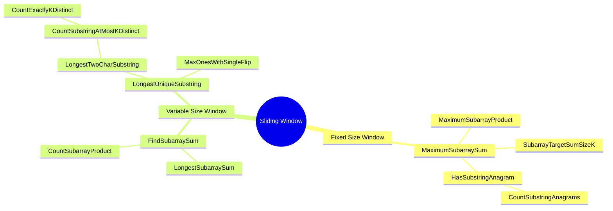
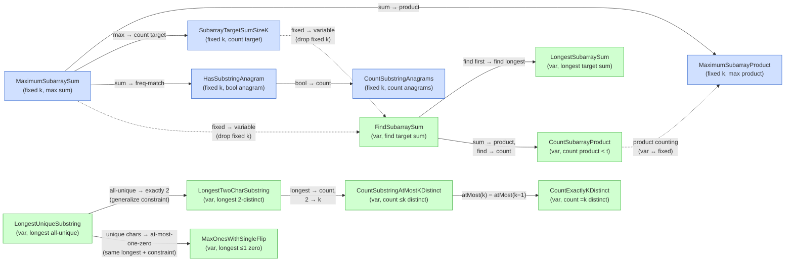

# Sliding Window Problems – Mindmap

> Nodes = problems · Edges = "slight variation of" relationships.
> Problems are coloured by **window type**: 🟦 fixed-size window, 🟩 variable-size window.

---

## Relationship Graph (detailed edges)

---

## Legend

| Colour | Meaning |
|--------|---------|
| 🟦 Blue | **Fixed-size** sliding window (window length `k` is given) |
| 🟩 Green | **Variable-size** sliding window (window shrinks/grows by constraint) |
| **Solid arrow** | Direct, slight variation |
| **Dashed arrow** | Cross-group bridge (fixed ↔ variable) |

---

## Variation Summary

| From → To | What changes |
|-----------|--------------|
| MaximumSubarraySum → MaximumSubarrayProduct | aggregation: **sum → product** |
| MaximumSubarraySum → SubarrayTargetSumSizeK | objective: **maximize → count matches** |
| MaximumSubarraySum → HasSubstringAnagram | window check: **sum → frequency-match** |
| HasSubstringAnagram → CountSubstringAnagrams | output: **boolean → count** |
| FindSubarraySum → LongestSubarraySum | objective: **find any → find longest** |
| FindSubarraySum → CountSubarrayProduct | aggregation: **sum → product**, objective: **find → count** |
| LongestUniqueSubstring → LongestTwoCharSubstring | constraint: **all unique → exactly 2 distinct** |
| LongestUniqueSubstring → MaxOnesWithSingleFlip | constraint: **all unique chars → at most one zero** (same "longest window with constraint" pattern) |
| LongestTwoCharSubstring → CountSubstringAtMostKDistinct | objective: **longest → count**, constraint: **2 → k** |
| CountSubstringAtMostKDistinct → CountExactlyKDistinct | trick: **atMost(k) − atMost(k−1)** reuses the same core |
| MaximumSubarraySum → FindSubarraySum | window type: **fixed → variable** (remove fixed `k`) |
| CountSubarrayProduct ↔ MaximumSubarrayProduct | window type: **variable ↔ fixed**, both use product |

